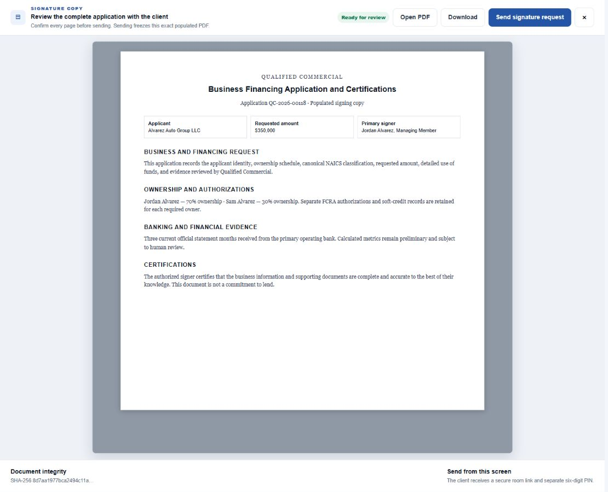
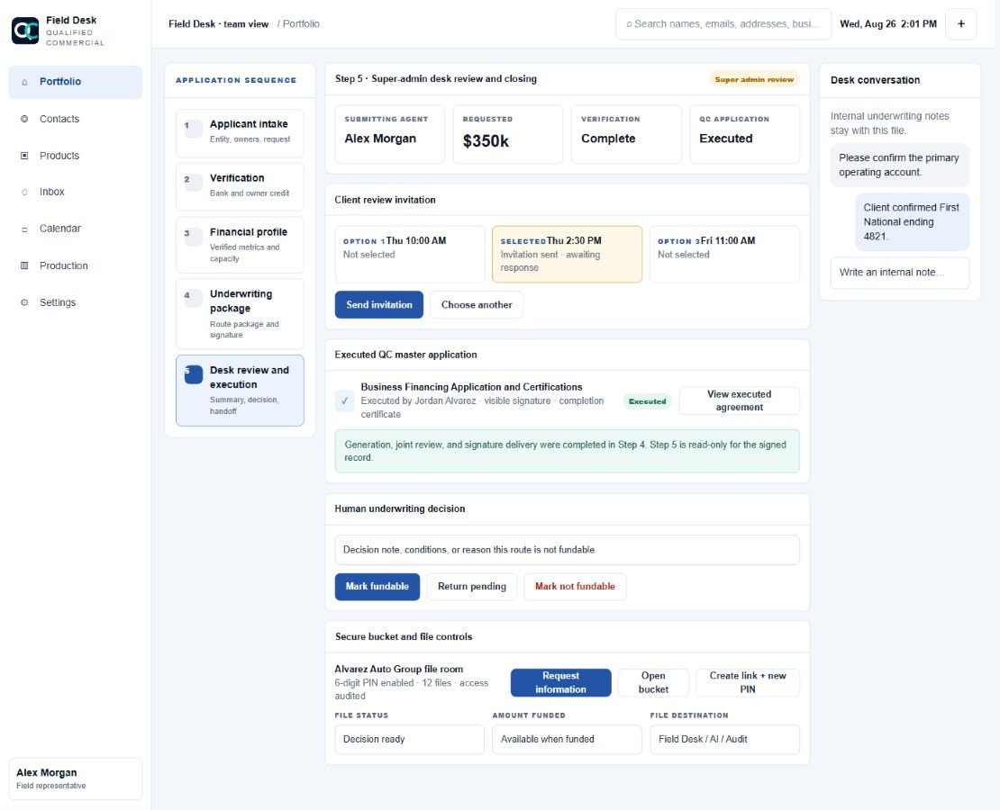
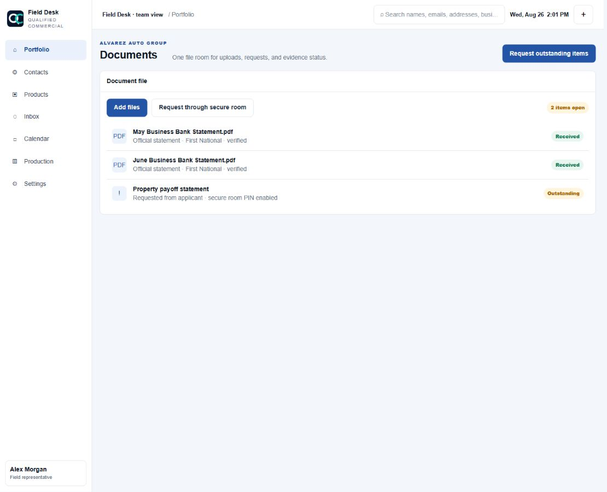
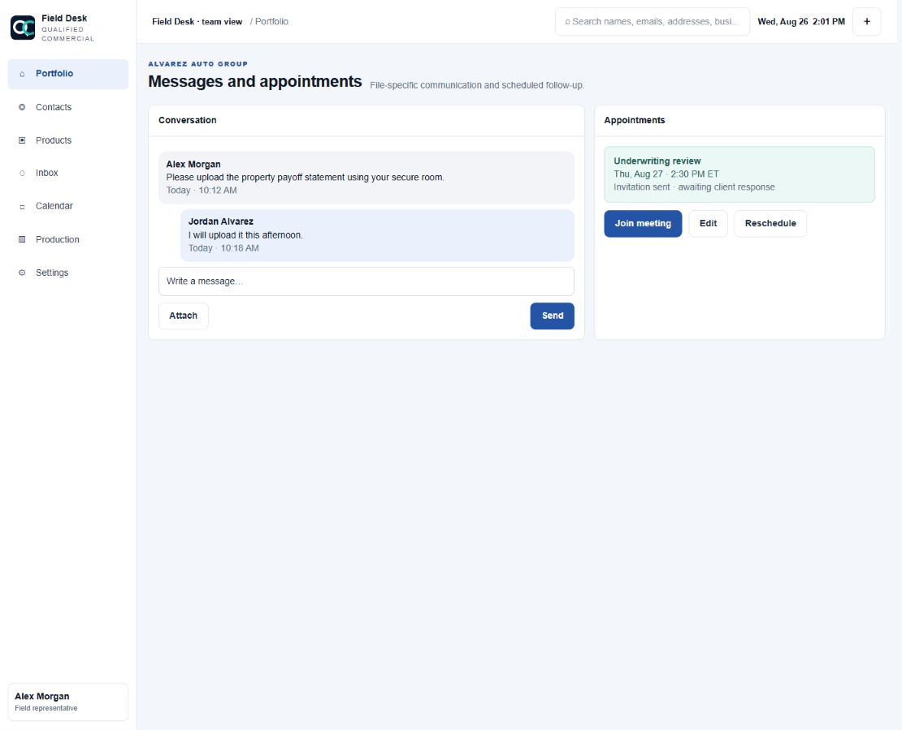
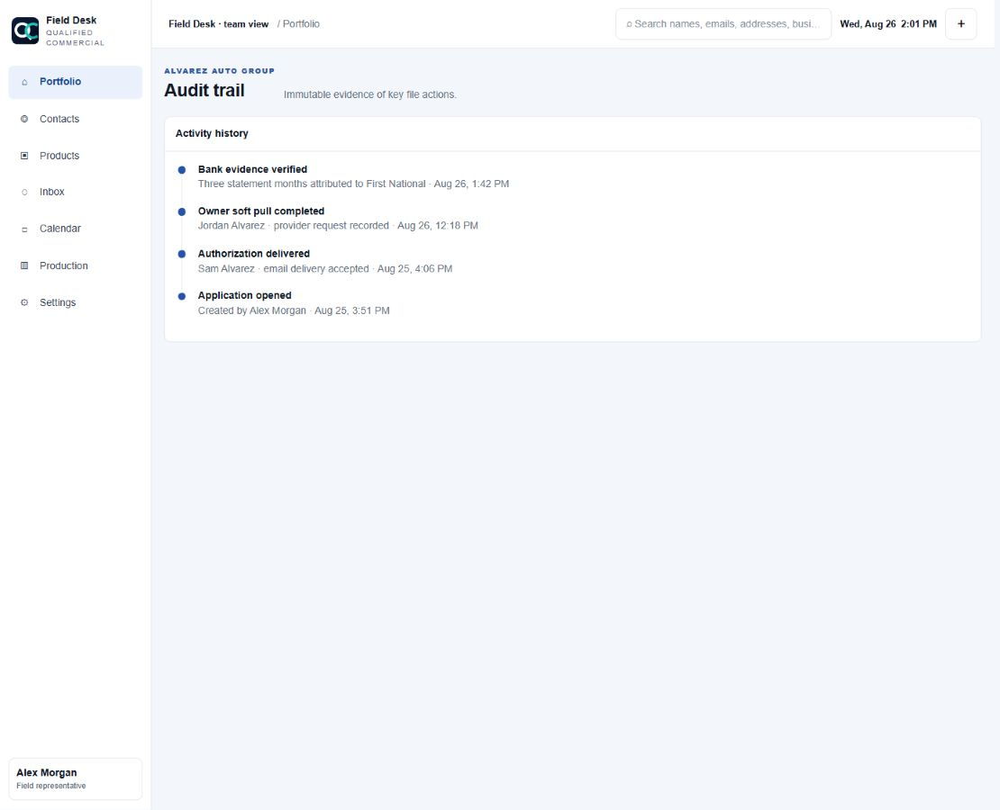

# Field Desk Application Workflow Training Booklet

This guide uses sanitized training data. It explains the current five-step Field Desk workflow, the unnumbered eligibility checkpoint, the signature checkpoint between Steps 4 and 5, and the supporting file tools.

## Workflow at a Glance

1. **Step 1 - Applicant intake:** establish the business, exact NAICS activity, ownership, request, and use of funds.
2. **Eligibility checkpoint:** record self-reported owner and file-level routing facts.
3. **Step 2 - Verification:** obtain official bank evidence and an independent soft-credit authorization from every 20%+ owner.
4. **Step 3 - Financial profile:** review verified balances, cash flow, debt service, and route posture.
5. **Review windows:** collect three client-preferred times without reserving the calendar.
6. **Step 4 - Underwriting package and signature:** complete route evidence, generate the QC application, review it, and send it to the primary signer.
7. **Step 5 - Super-admin desk review:** select a review time, make the human decision, manage the secure bucket, set final status and amount, and choose the file destination.

The system gates progression. Staff should correct missing information rather than bypassing a gate.

## 1. Portfolio

**Purpose:** Find, open, filter, archive, and monitor funding files.

**Agent actions**

- Search by business, owner, email, phone, or address.
- Filter applications and drafts by stage, bank status, credit status, and update date.
- Click anywhere on a row to open the file.
- Use the X only when the file should be archived from the rep portfolio. Archiving does not delete backend records.
- Use the global header search to locate related contacts, files, email/SMS threads, and appointments.

**Outcome:** The correct existing record is opened instead of creating a duplicate contact or application.

## 2. Open a New Application

**Purpose:** Create the file and collect enough information to enter Step 1.

**Required before opening**

- Business name.
- Entity type.
- Complete NAICS category, subcategory, and six-digit activity.
- Requested amount.
- Funding purpose.
- Written use-of-funds explanation.

**Optional at this point**

- General business phone and email.
- EIN.
- Trading-since date.
- Business address.

**Agent instructions**

- Use the drilldown NAICS finder. Do not guess from a broad industry label.
- Use the configured address search; if no result is found, enter street, city, state, and ZIP manually.
- Describe how the money will actually be used. Avoid entries such as "business expenses" without detail.
- Red borders identify required fields. They clear immediately after a valid value is entered.
- Minimize preserves the draft in the bottom workspace dock. Close removes only the open workspace.

**Outcome:** A new application opens in Step 1 with NAICS and request details transferred into the file.

## 3. Step 1 - Applicant Intake

**Purpose:** Complete the business identity, ownership schedule, and funding request.

**Business information**

- Confirm legal entity name, DBA when applicable, entity type, website, state of formation, start date, and addresses.
- Confirm the canonical NAICS hierarchy. If the activity does not match the business, reopen the drilldown selector.
- Pending custom classifications require human review and cannot create an automatic eligibility approval.

**Ownership table**

- Select `Add owner` to append a row. Up to five owners are supported.
- Capture first name, last name, ownership percentage, personal email, and personal phone.
- Ownership must equal exactly 100.00%.
- Every owner at 20.00% or more requires personal email and phone and is marked `iSoftPull required`.
- Owners below 20% remain on the ownership schedule but do not receive a credit request.
- Do not reuse one owner's contact information for another owner.

**Funding request**

- Confirm requested amount, purpose, and detailed written use of funds.
- Preserve the client's original request even if later routing suggests a different amount or program.

**Completion gate**

- Every owner row is saved and valid.
- Ownership totals 100.00%.
- Every 20%+ owner has complete personal contact information.
- Required applicant and request fields are complete.
- Eligibility answers are complete.

**Outcome:** Step 2 becomes available after the unnumbered eligibility checkpoint is completed.

## 4. Step 1.5 - Eligibility Checkpoint

**Purpose:** Create a versioned, self-reported preliminary routing snapshot without pretending the information is verified.

**How to complete it**

- Work through one 20%+ owner at a time.
- Use the explicit Yes/No controls. Timing follow-ups appear only when needed.
- Identify U.S. citizen, legal permanent resident, or other status exactly.
- Record whether estimated credit meets the 660 threshold; do not enter or display a raw credit score.
- Record bankruptcy, foreclosure, felony, misdemeanor, recent arrest, financial-crime, legal-charge, sanctions, lien, and judgment answers when presented.
- Complete the file-level questions, including whether proceeds refinance debt and any restricted-business-model flags.

**Important behavior**

- A disqualifying answer blocks only the affected program.
- The application may still proceed through verification for alternative paths.
- These answers never replace bureau or bank evidence.

**Outcome:** The file receives a borrower-safe preliminary route result labeled `Self-reported and unverified`.

## 5. Step 2 - Verification

**Purpose:** Obtain official banking evidence and independent owner credit authorizations.

**Bank evidence**

- Connect the primary operating bank with Plaid.
- Connect additional institutions when the business uses more than one operating account.
- Confirm which institution is the primary operating bank.
- Plaid is complete only when actual statement coverage exists; a connection alone is not enough.
- Upload official bank-produced PDF statements when Plaid statements are unavailable.
- CSVs, screenshots, and unsupported digital-bank exports are supplemental only.
- Use the PIN-protected secure room when the client will upload documents remotely.

**Owner soft-credit authorizations**

- Each 20%+ owner receives a unique, one-time secure authorization link.
- Send, resend, or copy the link from that owner's row only.
- Verify the displayed email and phone before sending. Corrections update the owner record.
- Email is the primary channel. SMS is used only for the exact number with valid transactional consent.
- One owner's completion never satisfies another owner's requirement.

**Completion gate**

- Three current official statement months are present.
- Every required owner has completed their individual authorization and pull.

**Outcome:** Step 3 unlocks with verified evidence linked to its source institution and owner.

## 6. Step 3 - Verified Financial Profile

**Purpose:** Review the financial facts produced from verified evidence before building the submission package.

**What to review**

- Credit tier status for all required owners. Raw scores are not shown.
- Average daily balance, returned items, and calculated DSCR.
- Up to six statement months in the balance trend.
- Three separate balance series: starting balance, ending balance, and average daily balance.
- Hover, keyboard-focus, or tap a month to inspect deposits, low balance, and returned-item details.
- Program posture with the exact NAICS or policy rule that supports each result.

**Debt-service helper**

Monthly debt payments are scheduled monthly payments on loans, lines of credit, equipment notes, SBA debt, MCAs, and property debt paid by the business. Enter the payment burden, not the outstanding balances.

**Accuracy rule**

- Unsupported metrics display `Awaiting evidence` or a dash.
- A failed route does not automatically fail every possible funding path.
- This screen is an underwriting analysis, not a commitment to lend.

**Outcome:** The agent understands the evidence-supported route posture and can collect the required review windows.

## 7. Select Three Review Windows

**Purpose:** Record three times when the client can speak with underwriting during the next 48 business hours.

**Agent instructions**

- Select three distinct windows. Weekends are excluded.
- Confirm the client's timezone before saving.
- Explain that these are preferences only and do not reserve calendar time.
- Do not promise that a proposed time is booked.

**What happens next**

- In Step 5, a super admin chooses one proposal.
- The system rechecks Franco's live Google Calendar and the configured buffers.
- Only the selected available time creates an appointment and invitation.
- Client acceptance changes the RSVP state to green `Confirmed`; unanswered remains amber.

**Outcome:** Three auditable client preferences are attached to the file without blocking calendar capacity.

## 8. Step 4 - Underwriting Package and Signature Checkpoint

**Purpose:** Complete the route-specific evidence package and execute the QC master application. This is the final agent-owned stage.

**Underwriting package**

- Review every requirement as complete, missing, supplemental, or not applicable.
- Confirm the evidence source and rules version.
- Enter annual sales, cash flow available for debt, and monthly debt payments when supported.
- Request only evidence required by the viable route.
- Product-specific SBA, state, or downstream forms remain separate requested artifacts.

**QC master application**

- Select `Generate application` only after the package is ready.
- The system creates a populated lender-neutral PDF with business, NAICS, owners, request, financial summary, evidence, conditions, and certifications.
- The PDF excludes SSNs, raw credit scores, and downstream lender identity.
- Select `Review and send` to open the focused agreement workspace.

**Completion gate**

- Route-specific package is complete.
- The primary owner or authorized representative has executed the exact generated PDF.

**Outcome:** The agent workflow is complete and the signed application is ready for super-admin Step 5.

## 9. Agreement Review and Signature Request

**Purpose:** Review the exact application with the client before sending it for independent signature.

**Agent instructions**

- Read through the complete populated PDF with the client.
- Confirm legal entity, ownership, NAICS, requested amount, use of funds, evidence summary, and signer name/title.
- Use `Open PDF` or `Download` when a larger native PDF view is needed.
- Select `Send signature request` from this screen only after the review is complete.
- Copy the secure room link and six-digit PIN when email delivery is unavailable or the client needs help locating it.

**Security and execution**

- Sending freezes the exact populated PDF and records its SHA-256 hash.
- The client signs independently in the secure room. The agent must never draw or apply the client's signature.
- The executed PDF includes the visible signature, typed name, title, timestamp, IP, user agent, document hash, signature hash, and certificate.
- The executed PDF downloads for the signer and is emailed to the signer. Email delivery failure does not invalidate execution.

**Outcome:** The contract status becomes `Executed`, enabling final desk review.

## 10. Step 5 - Super-Admin Desk Review and Closing

**Purpose:** Give the super admin one final control surface for decision, appointment, agreement review, bucket requests, status, amount, and handoff.

**Summary review**

- Confirm Step 1 applicant/request details and canonical NAICS.
- Confirm Step 2 bank coverage and owner credit completion.
- Confirm Step 3 financial metrics and Step 4 package status.
- Review submitting agent and primary signer.
- Open the executed QC agreement. Step 5 cannot generate or send a second signing copy.

**Calendar action**

- Select one of the client's three proposed windows.
- Send the invitation only after the live FreeBusy and buffer check passes.
- Monitor client RSVP: green accepted, amber awaiting response, blue tentative, red declined, gray unknown/cancelled.

**Human decision**

- `Mark fundable` records a positive human desk decision.
- `Return pending` records that more work or evidence is required.
- `Mark not fundable` requires a clear decision note.
- AI or deterministic routing does not replace this human decision.

**Bucket and closing controls**

- Open the secure bucket and request additional information.
- Create or rotate the secure link and six-digit PIN when needed. Rotation invalidates the prior PIN.
- Set file status and final funded amount.
- Continue the file into AI underwriting or convert it to the full audit system while preserving evidence and history.

**Outcome:** The file has an auditable human disposition and correct final destination.

## 11. Documents

**Purpose:** Use one document workspace for uploads, requests, and evidence status.

- Add files by picker or drag-and-drop. Upload begins immediately.
- Monitor compact per-file upload and processing states.
- Request missing items through the secure room.
- Confirm source institution, statement coverage, and official-versus-supplemental status.
- A 401 or failed upload must be retried after confirming the session; do not assume the document reached the file.

## 12. Messages and Appointments

**Purpose:** Keep client communication and scheduled follow-up linked to the correct file.

- Use the attachment menu inside a conversation to share the rep business card or book an appointment with that contact.
- Global business-card and appointment actions start blank; they do not silently reuse a selected thread.
- Agents see only their assigned inbox conversations.
- View invitation delivery and RSVP status.
- Join, edit, reschedule, or cancel appointments within role permissions.

## 13. Audit Trail

**Purpose:** Review immutable evidence of key file actions.

- Inspect authorization delivery, opened/completed events, evidence imports, appointment activity, status changes, agreement execution, and actor/timestamp history.
- The audit trail is evidence. Do not use it as an editable note area.

## Agent Guardrails

1. Never promise approval, pricing, or closing timing.
2. Never enter or store SSNs or raw card details in Field Desk.
3. Never display or repeat raw bureau scores; use approved tier language.
4. Do not treat CSVs or screenshots as official bank statements.
5. Do not bypass ownership, eligibility, bank, credit, review-window, package, or signature gates.
6. Use canonical NAICS activity, not a guessed industry label.
7. Every 20%+ owner completes their own credit authorization.
8. Only the primary owner or authorized representative signs the QC master application.
9. Never sign for a client or send a PDF that was not reviewed.
10. Escalate unclear evidence, legal history, classification, or product fit to underwriting.

## Super-Admin Guardrails

1. Confirm the executed QC master application before recording the final decision.
2. Keep the deterministic/AI result separate from the human fundability decision.
3. Recheck live calendar availability before sending one proposed review window.
4. Use bucket PIN rotation intentionally because the prior PIN becomes invalid.
5. Record final funded amount only after the funded status is supported.
6. Preserve audit history when handing a file to AI underwriting or the full audit system.
