# Field Desk Application Training Manual

These screenshots use sanitized training data. They show the current Field Desk workflow without exposing a borrower’s personal or financial information.

## 1. Portfolio

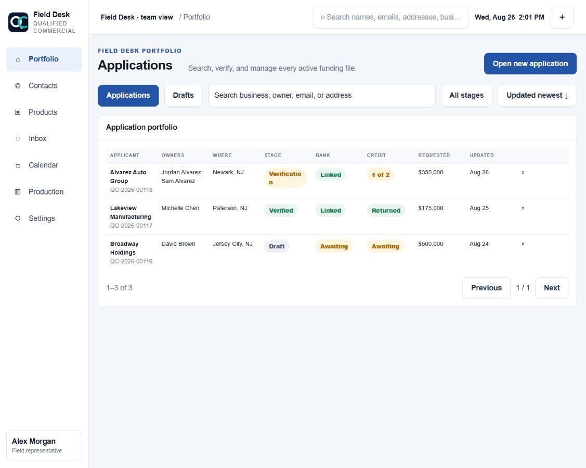

**Purpose:** Find, open, filter, archive, and monitor funding files.

- Search by business, owner, email, phone, or address.
- Filter active applications and drafts, verification stage, bank status, credit status, and update date.
- Click anywhere on a row to open the file.
- The X archives the file from the rep’s view; it does not delete backend records.
- The global header search also locates contacts, email/SMS threads, and appointments.

## 2. Open a New Application

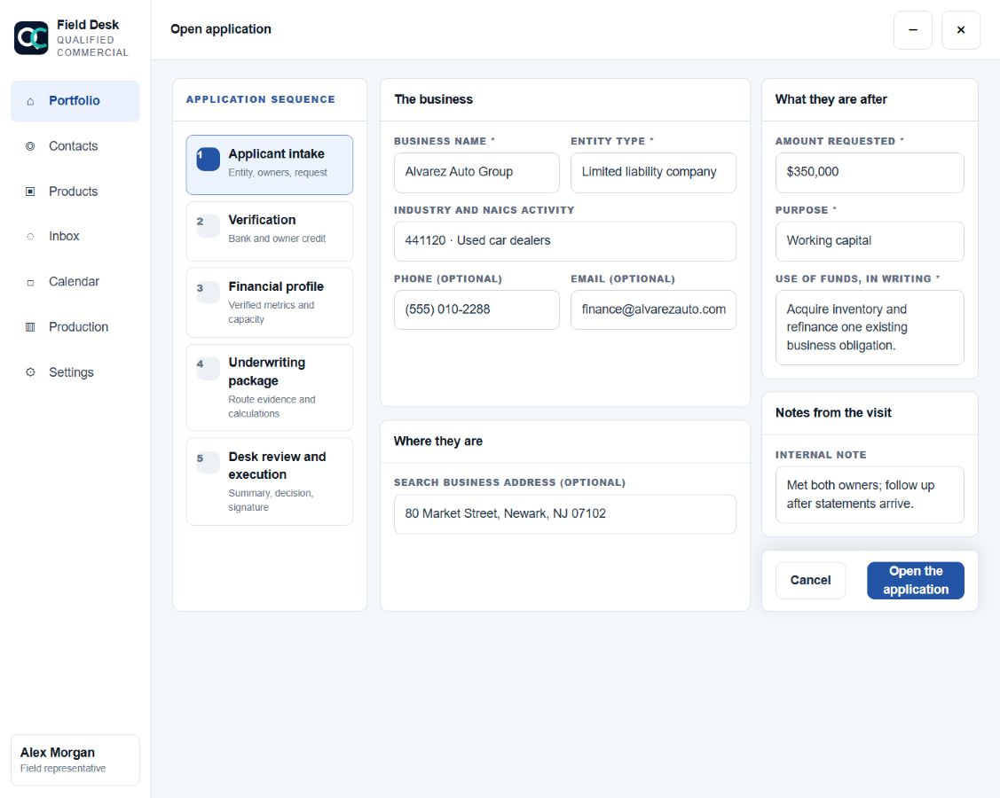

**Purpose:** Create the initial file with enough information to begin Step 1.

- The workspace opens full screen immediately while the Field Desk navigation remains available.
- Required: business name, entity type, complete NAICS activity, requested amount, purpose, and written use of funds.
- Optional: general business contact and business address.
- Address search uses the configured provider and retains manual entry as a fallback.
- Minimize preserves the draft in the bottom workspace dock. Close removes only the open workspace.

## 3. Step 1 - Applicant Intake

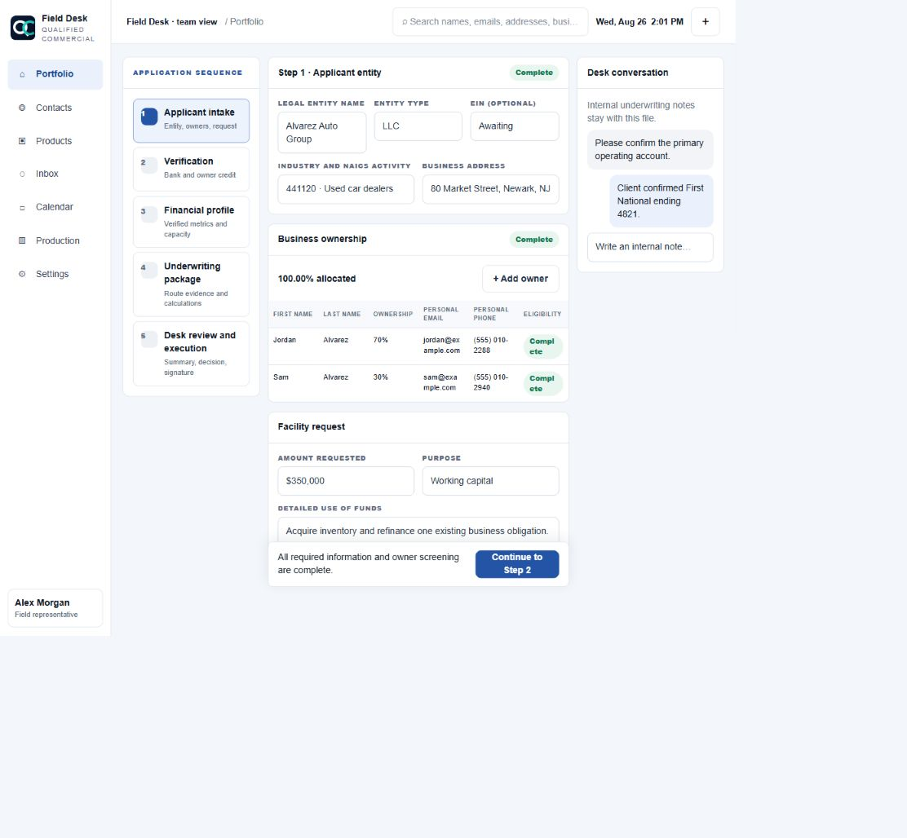

**Outcome:** A complete business identity, ownership schedule, request, and preliminary eligibility record.

- Confirm legal entity details and canonical category, subcategory, and six-digit NAICS activity.
- Add up to five owners. Ownership must total exactly 100%.
- Every owner at 20% or more requires first name, last name, personal email, and personal phone.
- Enter requested amount, funding purpose, and a detailed written explanation of how funds will be used.
- Red borders identify missing required information and clear as fields become valid.
- Continue remains disabled until all Step 1 requirements and the eligibility checkpoint are complete.

## 4. Step 1.5 - Eligibility Checkpoint

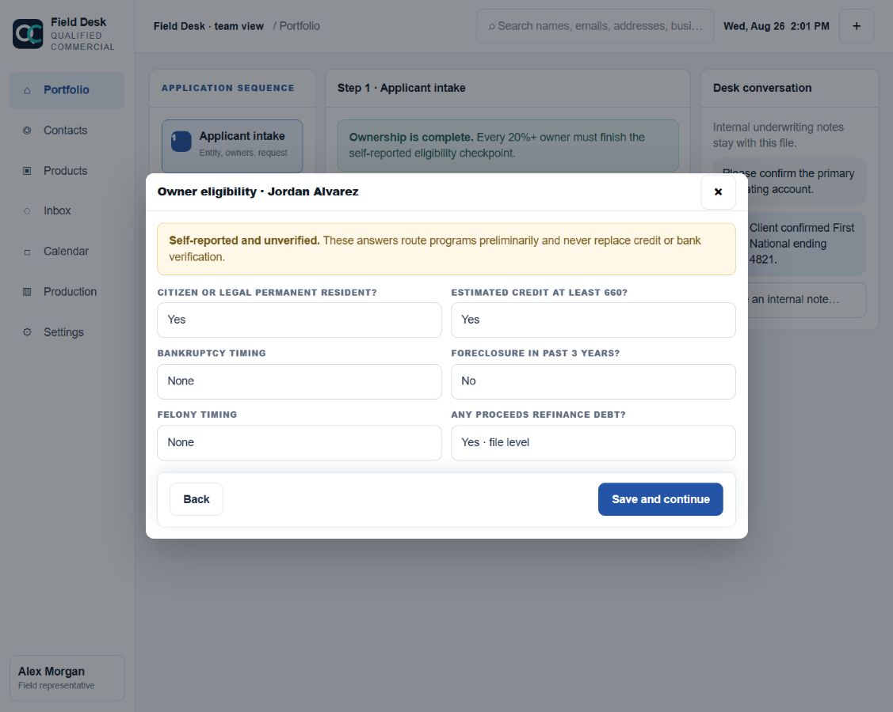

**Outcome:** A self-reported, versioned preliminary routing snapshot for each 20%+ owner.

- Record citizenship or permanent-resident status and whether estimated credit meets 660.
- Record bankruptcy, foreclosure, and felony timing.
- Record whether any proceeds will refinance debt.
- Complete one owner at a time to avoid skipping a required guarantor.
- These answers are unverified. They guide product routing but never replace iSoftPull or bank evidence.

## 5. Step 2 - Verification

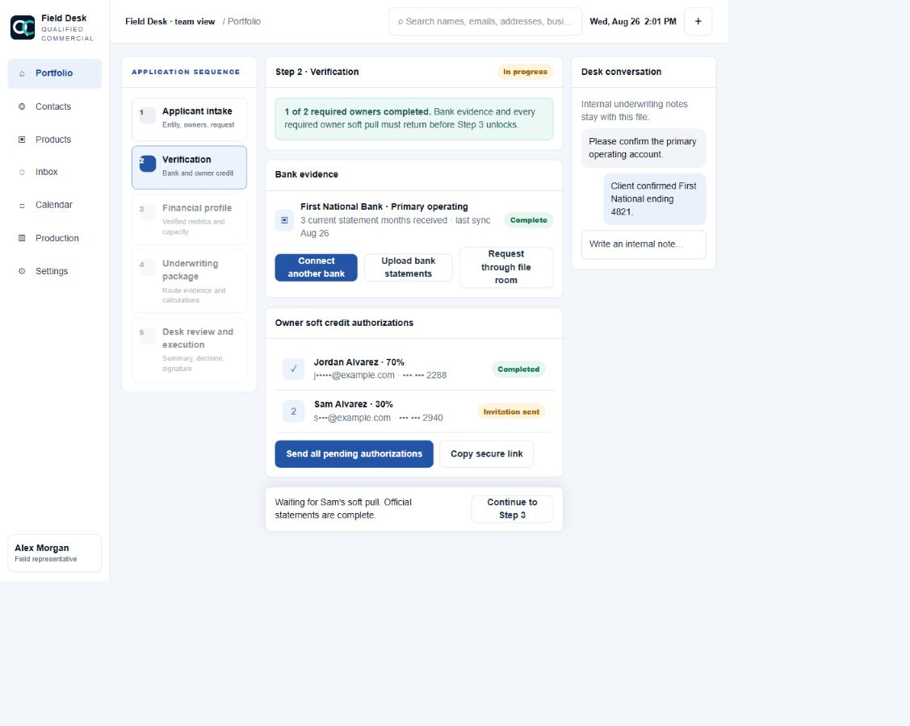

**Outcome:** Three current months of official bank statements plus a completed soft pull for every required owner.

- Connect the primary operating bank with Plaid and add other institutions when needed.
- Plaid is complete only when statement coverage exists; a connection by itself is not enough.
- Upload official PDF statements or request them through the secure six-digit-PIN file room.
- CSV files, screenshots, and unsupported exports are supplemental and do not satisfy official-statement requirements.
- Send, resend, or copy a unique authorization link for each 20%+ owner.
- One owner’s completion cannot unlock another owner.
- Step 3 unlocks only after official bank coverage and all required owner credit workflows complete.

## 6. Step 3 - Verified Financial Profile

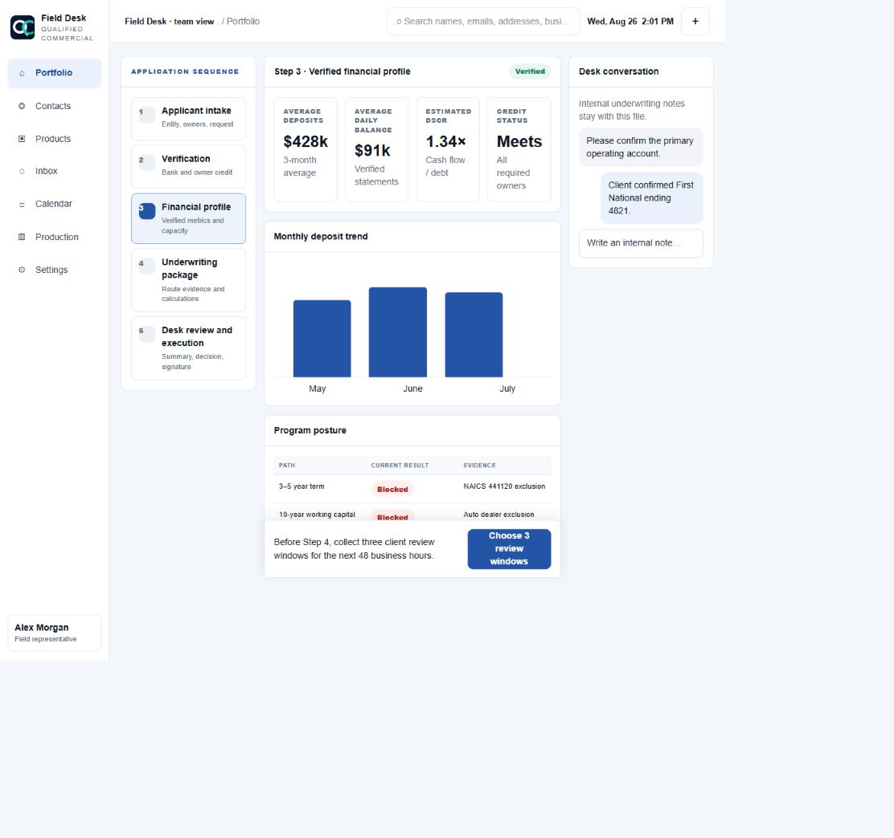

**Outcome:** Verified bank, cash-flow, debt-service, and eligibility metrics with source provenance.

- Review monthly deposits, balances, NSFs, negative days, and debt burden.
- Review DSCR and program posture. Unsupported values display as unavailable instead of being estimated without evidence.
- NAICS and legal/product rules can block one route while leaving other routes available.
- Explain that this is an underwriting screen, not a commitment to lend.

## 7. Select Three Review Windows

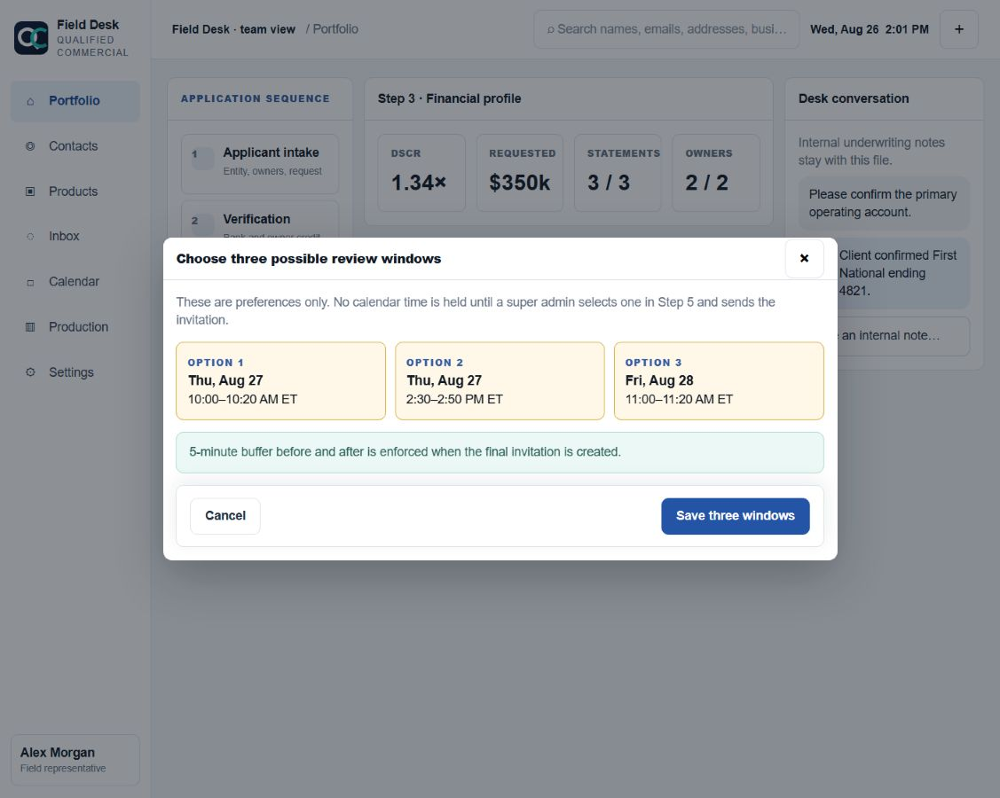

**Outcome:** Three client-preferred windows inside the next 48 business hours.

- Select three distinct windows; weekends are excluded.
- These choices do not reserve calendar time.
- A super admin selects one in Step 5, rechecks Franco’s shared calendar and buffers, then sends the invitation.
- Only the selected time is booked. Google attendee acceptance changes the appointment to Confirmed.

## 8. Step 4 - Underwriting Package

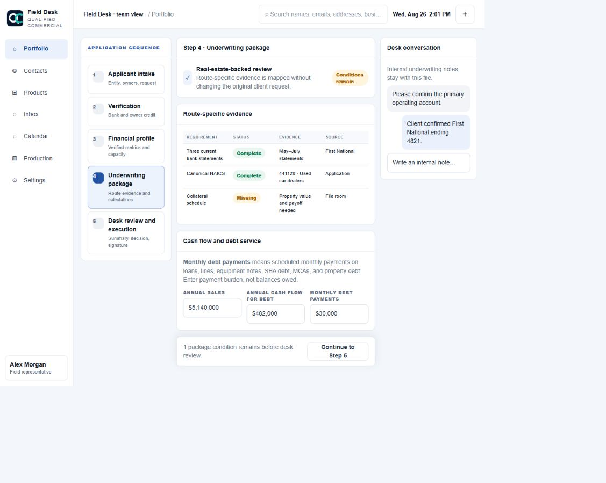

**Outcome:** A route-specific evidence package ready for human desk review.

- Review every requirement as complete, missing, supplemental, or not applicable.
- Confirm evidence source and the exact rule version used.
- Complete annual sales, cash flow available for debt, and monthly debt payments.
- Monthly debt payments are scheduled payments, not balances owed.
- Request only the missing evidence appropriate to the viable route.
- Continue unlocks when the package is complete; the human fundability decision occurs in Step 5.

## 9. Step 5 - Desk Review and Execution

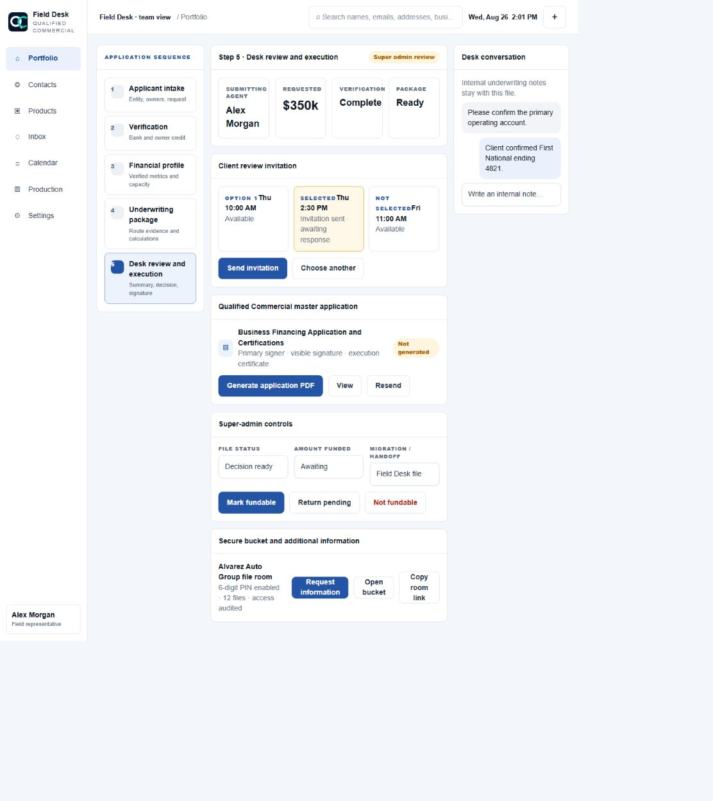

**Outcome:** Super-admin review, final invitation, signed QC application, secure file-room follow-up, and file disposition.

- Review the submitting agent, prior-step summary, requested amount, verified owners, and package status.
- Select one proposed client window, recheck availability, and send the Google invitation.
- Client acceptance produces the green Confirmed RSVP state; invitation sent remains amber.
- Mark the file fundable, return it pending, or mark it not fundable.
- Generate the Qualified Commercial Business Financing Application and Certifications.
- The primary authorized signer signs the master application. Each 20%+ owner’s separate iSoftPull remains referenced in the file.
- View or resend executed agreements. The signed PDF is emailed to the client and retained for secure download.
- Update status and funded amount, migrate or hand off the file, and request additional information through the PIN-protected bucket.

## 10. Documents

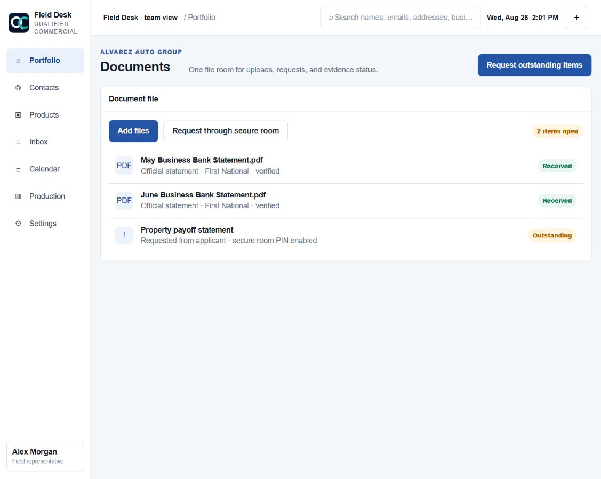

- Upload evidence and monitor each file’s upload/processing status.
- Request missing documents through the secure room.
- Verify source, statement coverage, and whether evidence is official or supplemental.

## 11. Messages and Appointments

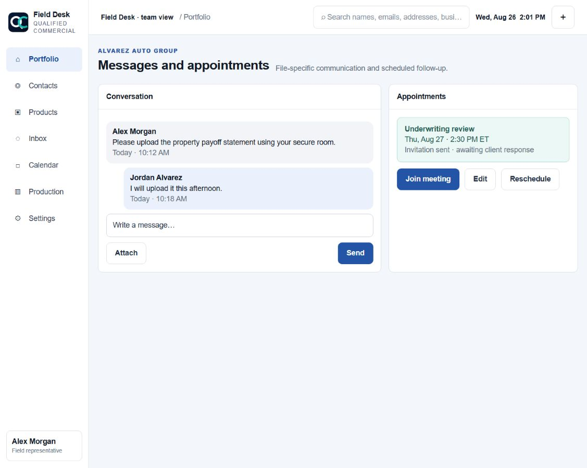

- Keep file-specific notes and borrower communication with the case.
- View invitation delivery and RSVP status.
- Join, edit, reschedule, or cancel appointments within role permissions.

## 12. Audit Trail

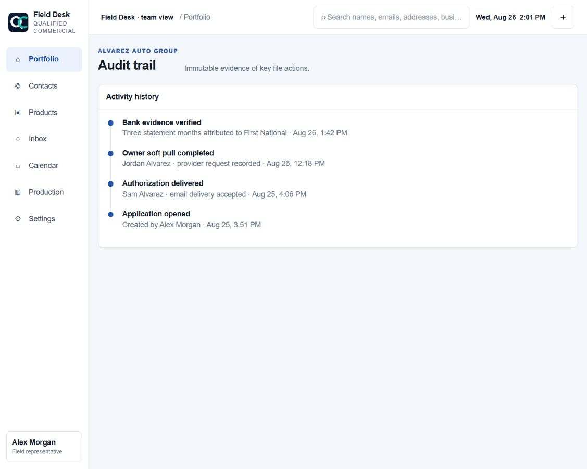

- Review authorization delivery, opened/completed events, evidence imports, status changes, agreement execution, and actor/timestamp history.
- The audit trail is evidence. Do not use it as an editable note area.

## Employee Guardrails

1. Never promise approval, pricing, or closing timing.
2. Never enter or store SSNs or raw card details in Field Desk.
3. Do not treat CSVs or screenshots as official bank statements.
4. Do not bypass ownership, eligibility, bank, credit, review-window, or package gates.
5. Use canonical NAICS activity, not a guessed industry label.
6. Every 20%+ owner completes their own authorization.
7. Escalate unclear evidence, legal history, classification, or product fit to underwriting.
